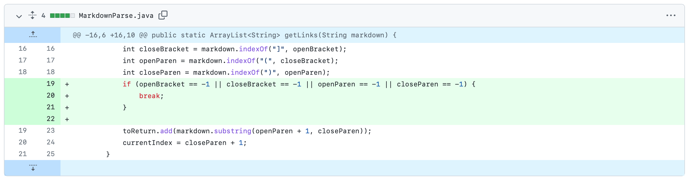
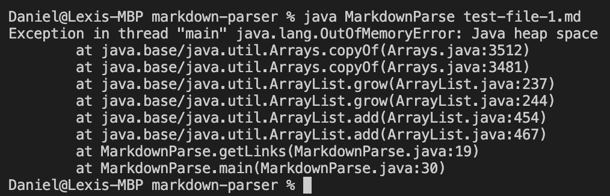
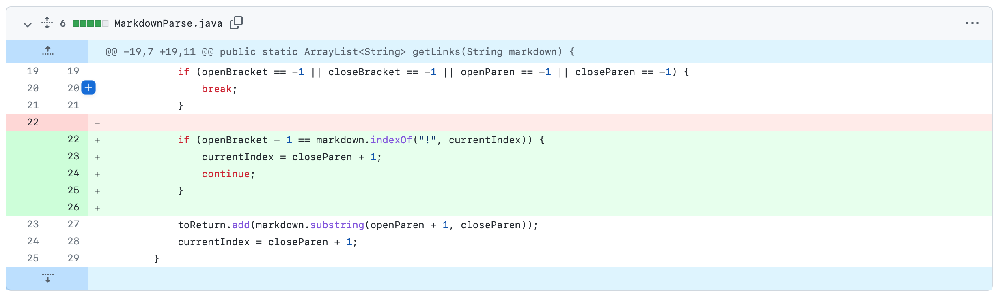
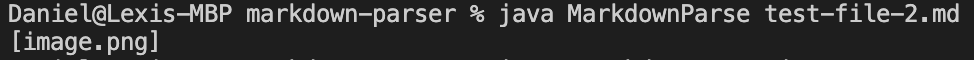
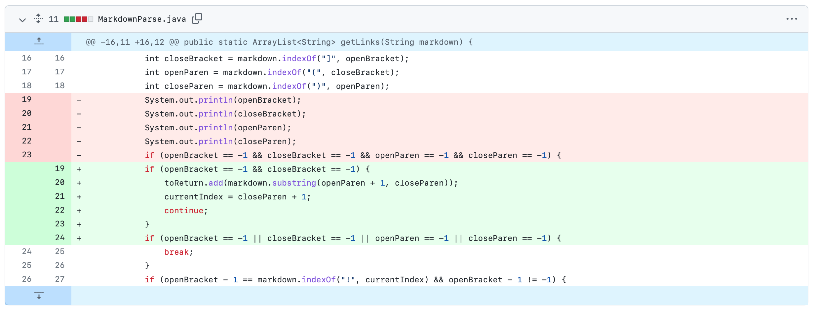
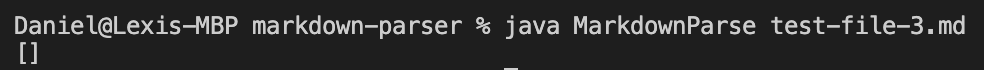

# Lab Report - Week 4

## Bug 1: Link Inside of Parenthesis

These are the code changes made in order to fix this bug:

Using [this failure inducing input](https://github.com/Daniel-P-Arevalo/markdown-parser/blob/main/test-file-1.md) that has a link in parentheses an out of memory error is produced as the symptom of this bug when given this input.

## Bug 2: Images

These are the code changes made in order to fix this bug:

When we use [this failure inducing input](https://github.com/Daniel-P-Arevalo/markdown-parser/blob/main/test-file-2.md) that has an image instead of a link an array containing the image name in the file is returned, which we don't want as it should only return links in the file meaning that this is a symptom of a bug.

## Bug 3: No Brackets

These are the code changes made in order to fix this bug:

By using [this failure inducing input](https://github.com/Daniel-P-Arevalo/markdown-parser/blob/main/test-file-3.md) of a link in parentheses and no brackets we get an empty array instead of the excepted array with the link, so this is a symptom of a bug.

