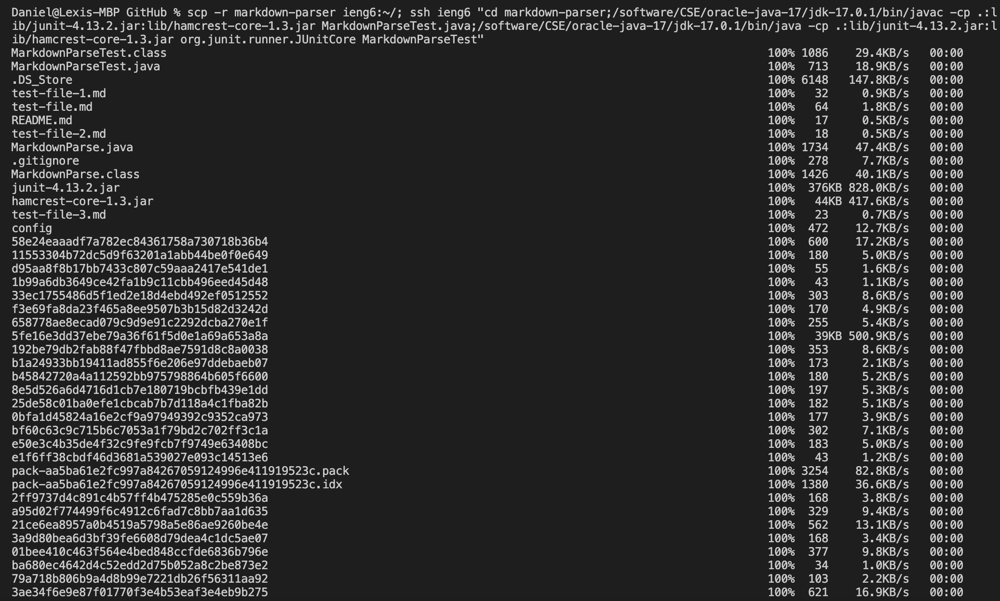
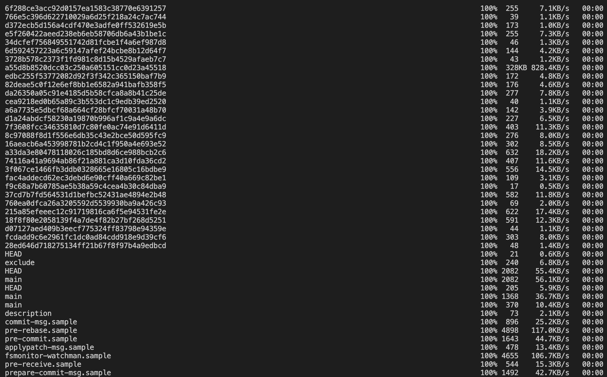
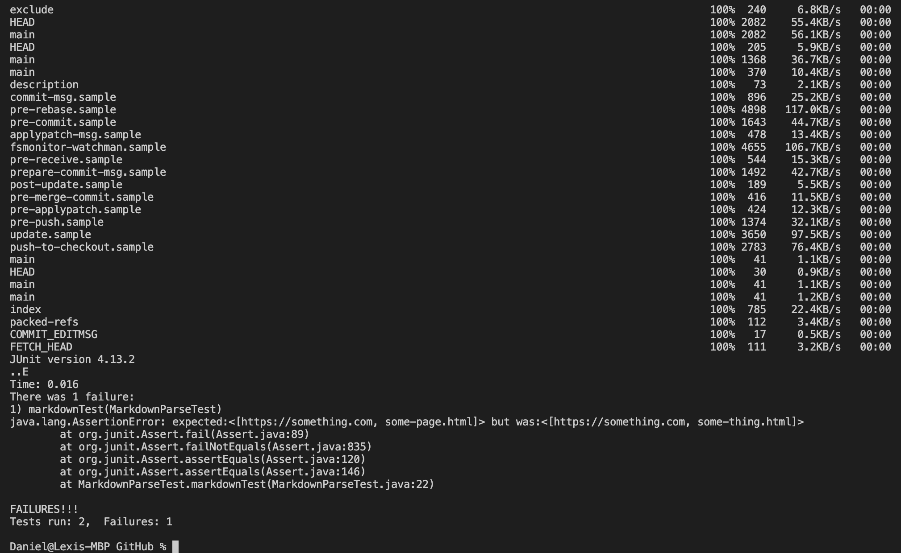

# Lab Report - Week 6

## Streamlining ssh Configuration

You can create a new config file in your local .ssh folder with this text in it:

With this config file created you're able to log into your course account with an alias instead typing cs15lsp22zzz@ieng6.ucsd.edu every time.

This new alias can be used in place of cs15lsp22zzz@ieng6.ucsd.edu for anything, such as with the command `scp`.

## Setup Github Access from ieng6

In GitHub the public key is stored in its own place under settings for ssh keys.

On your user account the public and private key are both located in the account's .ssh folder.

By putting the key on GitHub you're able to commit and push your changes to the repository on GitHub through the command line.

[This](https://github.com/Daniel-P-Arevalo/good-markdown-parser/commit/b8163dce27e3a8b55614507a54c7d8a9e882d609) is the resulting commit from the above commit and push.

## Copy Whole Directories with `scp -r`

With the command `scp -r` you're able to copy entire directories over to your user account and from there you can run it on your account.

You can also optimize the above commands into only two lines with the use of a semicolon as seen below.

