# Lab Report - Week 6

## Streamlining ssh Configuration

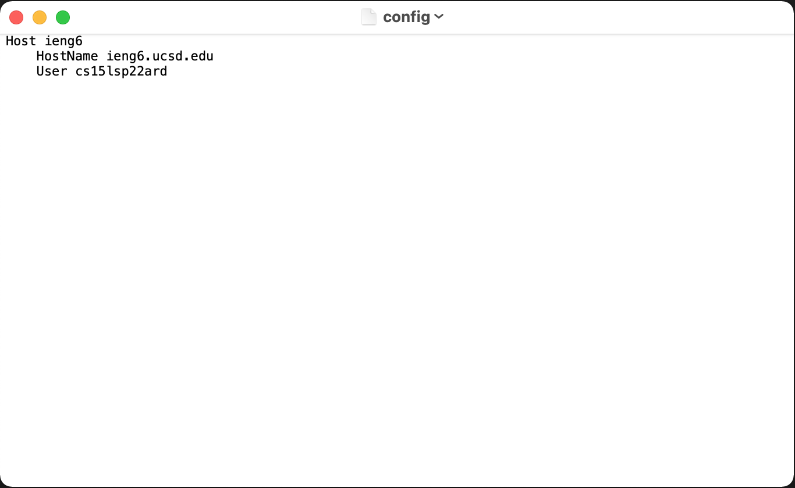
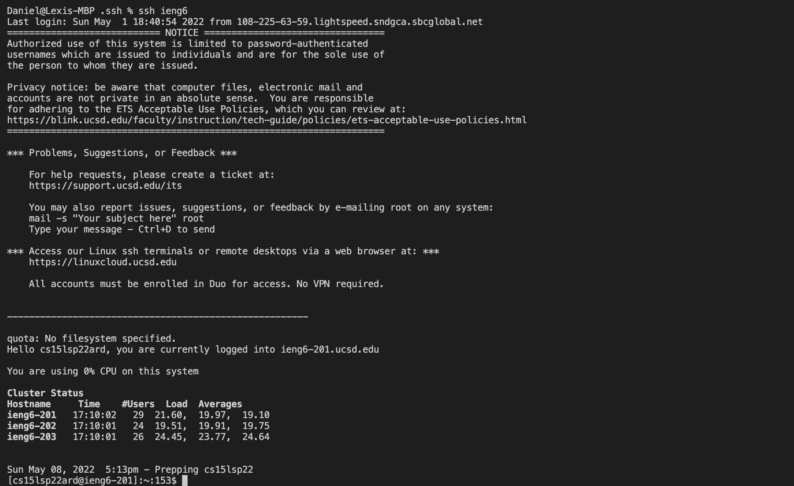
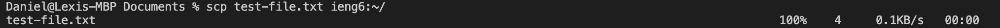

## Setup Github Access from ieng6

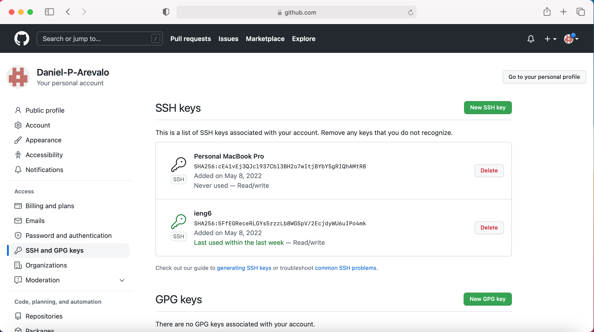
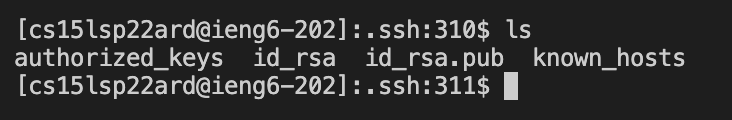
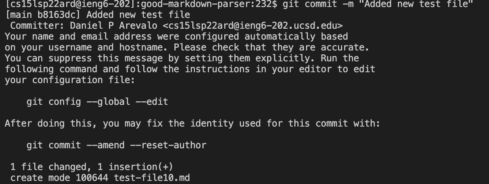
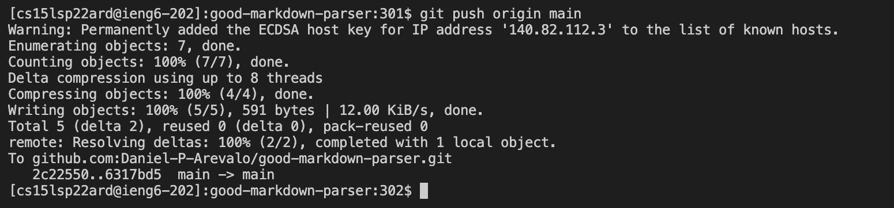
[ieng6_push](https://github.com/Daniel-P-Arevalo/good-markdown-parser/commit/b8163dce27e3a8b55614507a54c7d8a9e882d609)

## Copy Whole Directories with scp -r

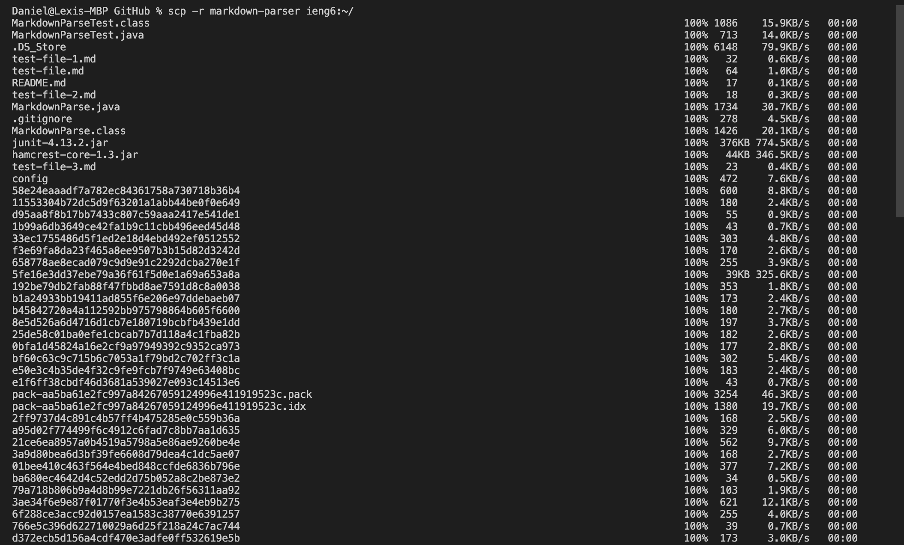
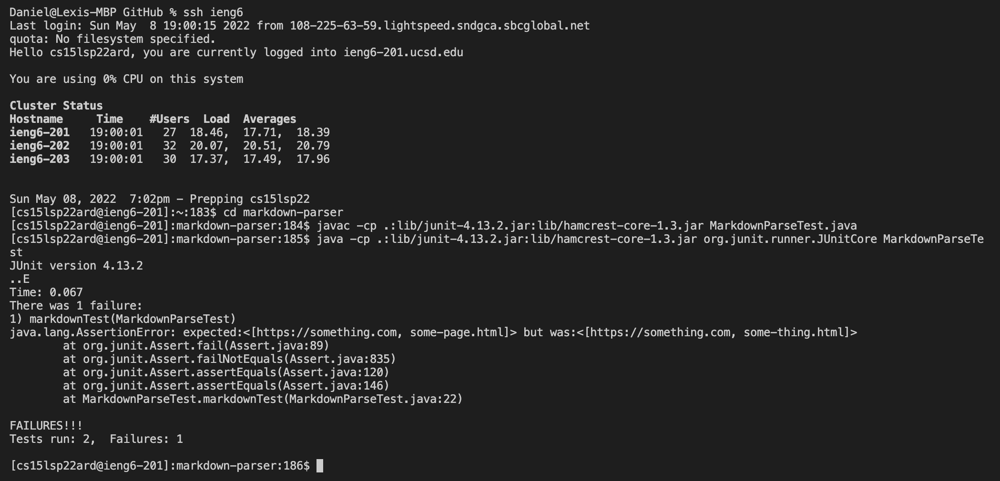
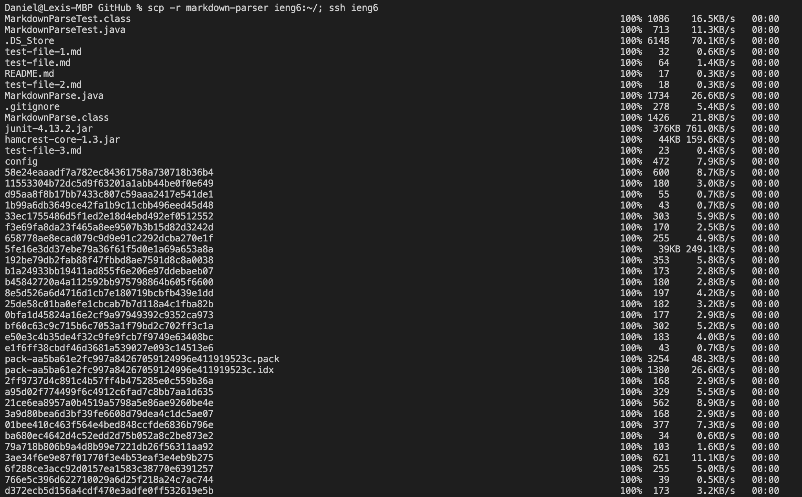
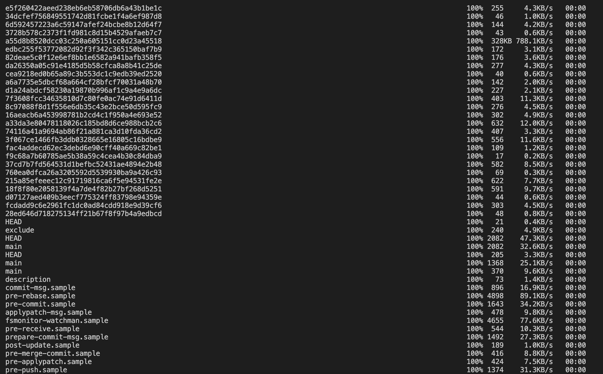
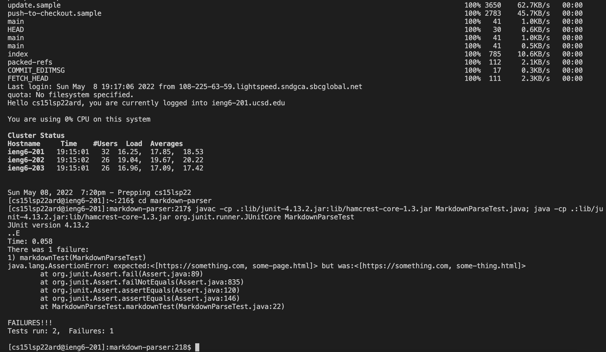
