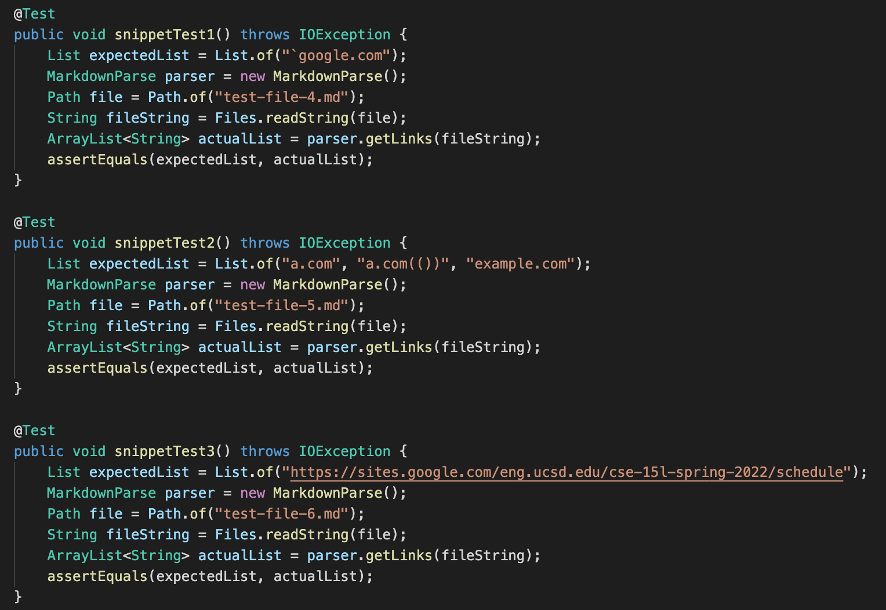
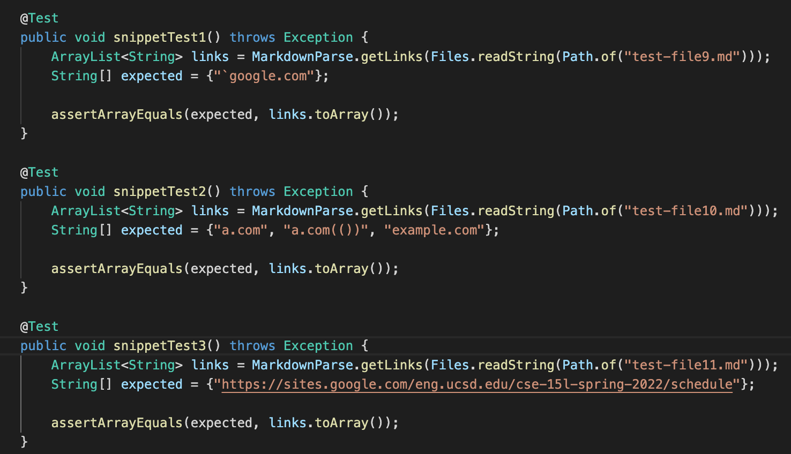
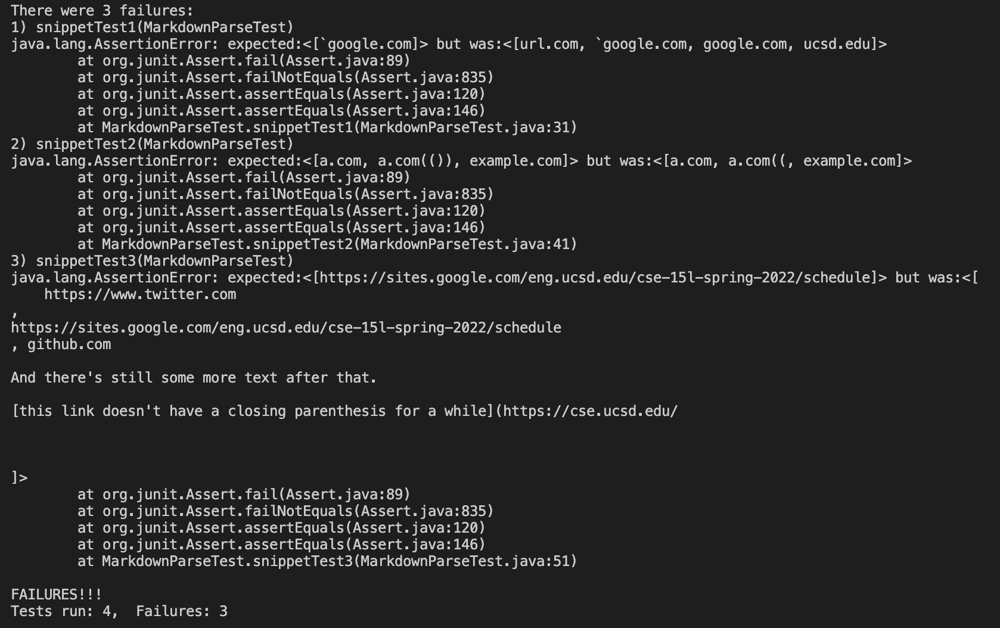
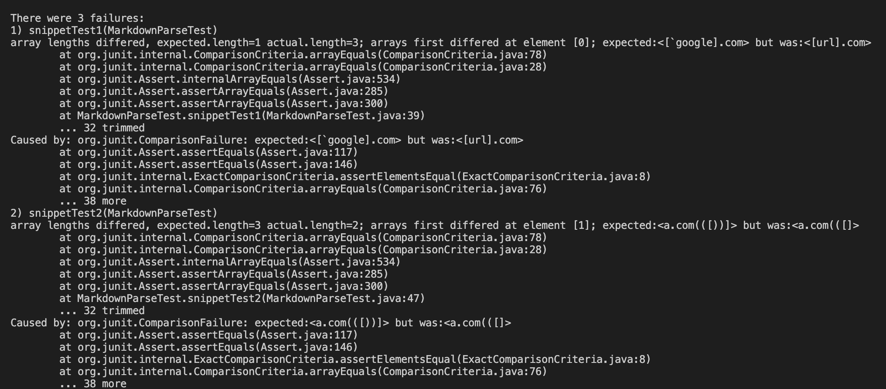
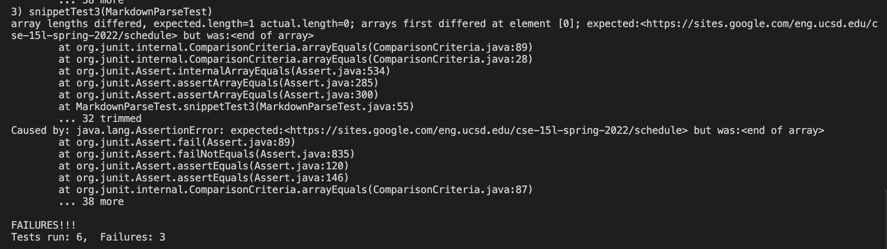

# Lab Report - Week 8

The two versions of MarkdownParse used:

[My implementation](https://github.com/Daniel-P-Arevalo/markdown-parser)

[The reviewed implementation](https://github.com/UDXS/markdown-parser)

Snippet 1 should produce [`google.com]

Snippet 2 should produce [a.com, a.com(()), example.com]

Snippet 3 should produce [https://sites.google.com/eng.ucsd.edu/cse-15l-spring-2022/schedule]

This is how I implemented the tests in my implementation of MarkdownParse:

This is how I implemented the tests in the reviewed implementation of MarkdownParse:

For my implementation of MarkdownParse it failed for all three snippets

For the reviewed implementation of MarkdownParse it failed for all three snippets

For snippet 1 I believe that a small change could be made to my implementation that ignores the link if the brackets are inclosed in back ticks.

For snippet 2 I believe that a fix would be a much more involved change as the code would need to be modified to search for brackets and parenthesis within brackets and parenthesis, which would involve searching for multiple starting brackets and parenthesis within others.

For snippet 3 I believe a small change could be made to my implementation that would ignore white space until the first character of the link.
